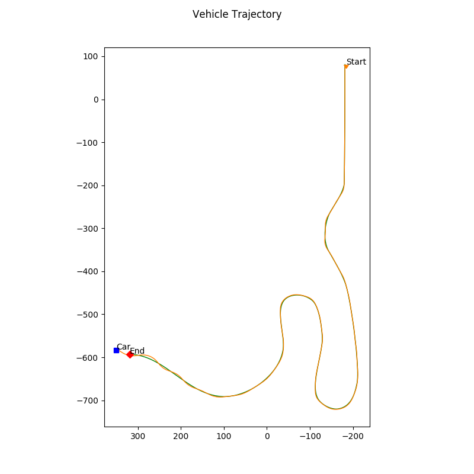

# Self Driving Vehicle Controller
This controller is made to autonomously follow a set of waypoints based on a given trajectory. Simulated and tested using CARLA. 

The blueprint for testing and development for the controller is provided by the Self-Driving Car Specialization from CourseEra/University of Toronto. The actual controller design is contained in `controller2d.py`.

## Controller Design
**Longitudinal Controller:** PID

**Lateral Controller:** Pure Pursuit

## Results
Simulated vehicle controller using `racetrack_waypoints.txt`. 

The following plot is graph that compares the actual trajectory (in orange) to the simulated trajectory generated by the controller (in green)

